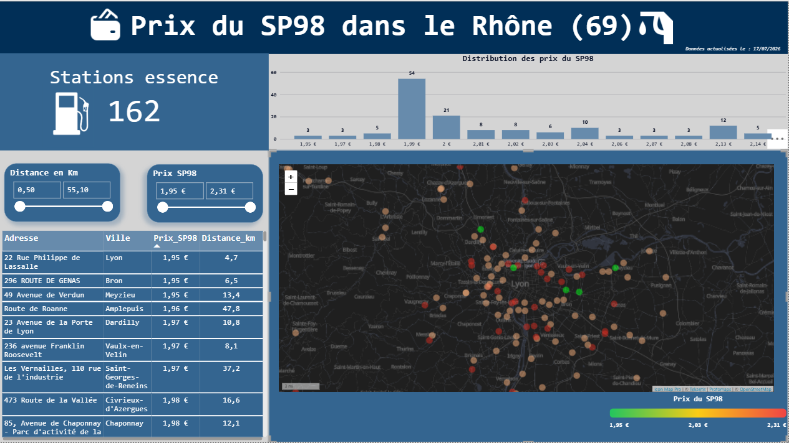

# ⛽ Prix du SP98 dans le Rhône — Dashboard Power BI

**Manager Data Marketing · Projet individuel**

## Problématique

Quelle est la station-service la moins chère en SP98 autour de chez moi ? Pipeline data complet, de la donnée brute au dashboard interactif, pour répondre à cette question sur le département du Rhône (69).

## Démarche

1. **Collecte** : Données officielles des prix des carburants, [data.gouv.fr](https://www.data.gouv.fr)
2. **Nettoyage (Google Sheets)** : Suppression des colonnes inutiles (population, horaires/services en JSON), éclatement de la géométrie en `latitude`/`longitude`, colonnes renommées en snake_case
3. **Chargement (BigQuery)** : Dataset `fr_carburant`, table importée depuis le CSV nettoyé
4. **Analyse SQL** : voir [`sql/01_exploration.sql`](sql/01_exploration.sql) : prix min/max, filtrage par département, comptage, calcul de distance géospatiale (`ST_DISTANCE`, `ST_GEOGPOINT`)
5. **Dashboarding (Power BI)** : voir [`sql/02_vue_dashboard.sql`](sql/02_vue_dashboard.sql) pour la vue finale consommée par le dashboard

## Dashboard

- 162 stations recensées dans le département du Rhône
- Distribution des prix du SP98 par palier
- Carte interactive (vert = moins cher, rouge = plus cher)
- Filtres croisés par distance et par prix
- Tableau détaillé triable (adresse, ville, prix, distance)

## Stack technique

data.gouv.fr · Google Sheets · Google BigQuery (SQL, fonctions géospatiales) · Power BI
